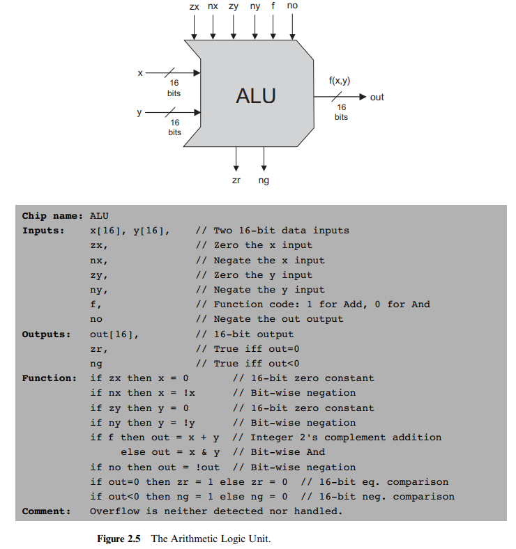
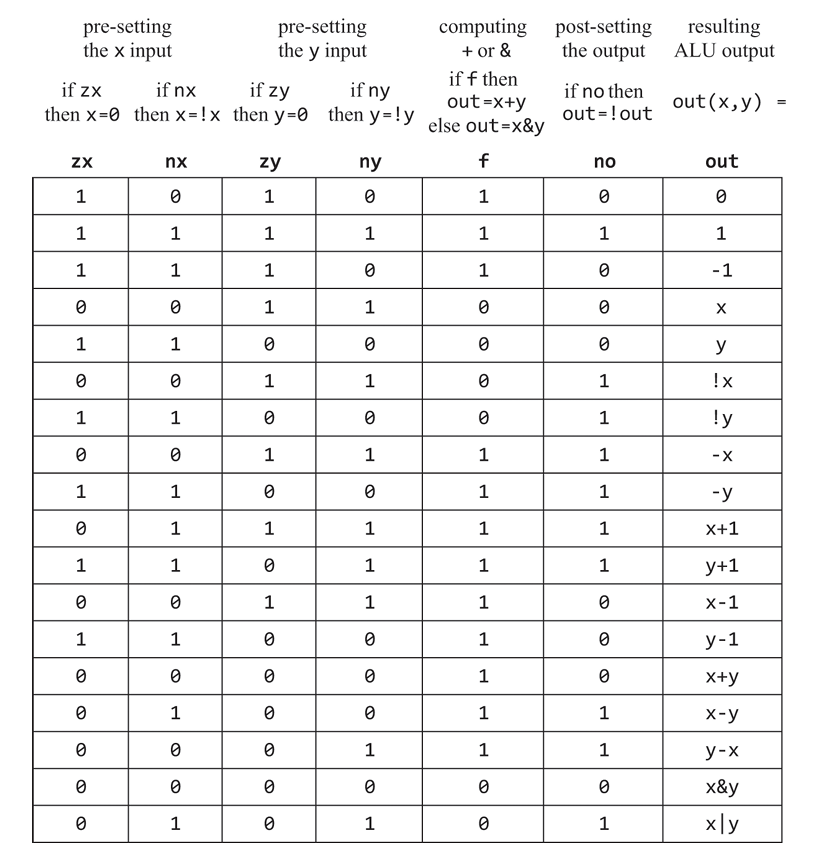

# 二、布尔计算

> Therefore, constructive understanding of binary addition
> holds the key to understanding many fundamental operations performed by
> the computer’s hardware.

## 总结

本章在第一章的基础上搭建了半加器、全加器、多位加法器和加一计数器。

同时，本章搭建了HACK计算机的ALU。ALU有6位控制信号，可对两个16位的操作数进行多种基本运算并输出。

## 进制转换

2 -> 10: 依权重相加。

10 -> 2: 以2除十进制数，余数即为最低位的值。以商作为新的十进制数，递归，可得结果。

## 负数表示

对N位二进制有符号数，通常采用补码方式实现，即负数等于原码取反再加一，利用**舍去溢出位的特点实现负数计算**。

可将此理解为作平移映射：

$$(-2^{N-1}, -1) \to (2^{N-1}, 2^N-1)\Rightarrow x + (-x) = 2^N = 0$$

即把数轴的负数部分向右“搬”到了正数的右边。

计算结果的值应当处于可表示的范围内，否则会得到错误的结果。这也是软件实现中需要注意的问题。

这一方法的关键优点是硬件实现时非常简单，加法器无需任何修改，符号判断也易于实现。

## 加法器

组合逻辑的多位加法器时序上存在竞争冒险问题，低位的进位信号需要更长的时间到达。

串行进位加法器设计简单，但速度慢。超前进位加法器通过增加电路的复杂度，更快得到高位的进位信号。

## ALU



算术逻辑单元。通过控制端实现对操作数的多种计算。

HACK的ALU有两路16位的输入，表示x和y两个操作数。一个16位的输出，表示计算结果。还有一个零标志位zr和一个负标志位ng，表示输出是否全零和是否为负。

此ALU硬件设计十分精巧，操作数经过置零、取反、加/与、取法四个步骤，可以实现十数种计算。作者说是通过列出想实现的功能，再逆推化简的方式设计而来。

此ALU没有乘除及浮点等功能，后续将通过软件方式实现。注意实际的ALU通常会用硬件实现这类基本算术功能。

**记住这个ALU**，它是魔法的起点。

## 代码

依据书中给出的提示实现即可。我们可以通过选择器实现受控的置零，再通过非门和选择器实现取反。之后使用加法器和与门实现加法和与运算，再通过选择器选择输出，最后再经过一次取反即可得到结果。

注意：
- 第零位为LSB
- 只允许在输出端切片
- zr在out全零时置高

## 计算推导

ALU可以计算：

```text
 * Computes one of the following functions:
 * x+y, x-y, y-x, 0, 1, -1, x, y, -x, -y, !x, !y,
 * x+1, y+1, x-1, y-1, x&y, x|y on two 16-bit inputs
 ```

书中并没有让我们思考如何设置控制端来实现这些计算，而是直接给出了每种计算的控制端设置。



其中一些计算的推导并不显然，这里尝试选择两个较为复杂的例子进行解释：

- 首先给出两条基本规则：
    1. 取反和负数的关系：$-x = !x + 1$
    2. 产生`-1`：$-1 = !0$

- `x-y`将`[nx,f,no]`置为1，即 $x-y=!(!x+y)$：

    $$x-y=-(-x+y-1)-1 = !(!x+1+y-1)+1-1 = !(!x+y)$$

- `x+1`将`[nx,zy,ny,f,no]`置为1，即 $x+1=!(!x+!0)$：

    $$x+1=-(-x-1-1)-1 = !(!x+1-1+!0)+1-1 = !(!x+!0)$$