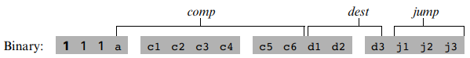
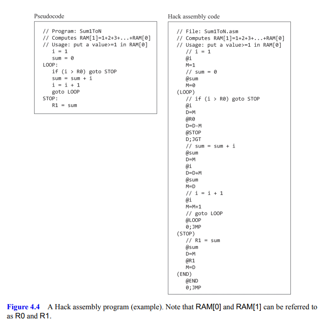
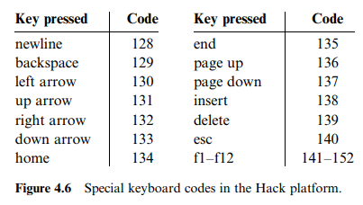

# 四、机器语言

## 总结

本章内容开始超出数电范畴，进入底层编程领域。

本章介绍机器语言，为下一章搭建通用计算机提供基础。

[Wiki](https://en.wikipedia.org/wiki/Hack_computer)

## 4.1 背景知识

> A machine language is an agreed-upon formalism designed to code machine instructions.

*机器语言可视为一种通过CPU和寄存器操作内存的规则*

### 4.1.1 机器结构

内存(Memory)存放数据和程序。

处理器(CPU)负责数学和逻辑运算、内存操作和控制操作

寄存器(Cache)用于临时存放处理器的操作数和结果，提高速度。

### 4.1.2 语言

对指令、内存和寄存器进行编码，它们组合起来可构成汇编语句。

语句通常包括指令、结果存储的位置、操作数（可直接给出值或是给出地址值，取决于指令）

E.g. 1010001100011001 → ADD R3, R1, R9 → 取R1, R9相加并存至R3

### 4.1.3 指令

包括数学和逻辑运算、内存读写、跳转等。

## 4.2 HACK机器语言

### 硬件结构

HACK为16位机器。由内存、CPU、键盘、屏幕组成。

内存由各32K的程序内存和数据内存(M)组成，对应15位的地址长度。

CPU对程序内存是只读的，意味着其可以用ROM实现，如游戏卡带一样。

CPU内含两个16位寄存器，称为D和A。D专用于存储数据，A用于存储数据和地址。

### 指令(Instruction Set Architecture)

A指令用于写入A寄存器。

C指令语句可包括计算(comp)、目的地(dest)、跳转(jump)三部分。

计算部分共7位，编码与ALU相似，其中第一位(a)决定A作为地址还是数据。

数据的位置可以是D, A, M[A]，目的地部分共三位，分别控制是否将结果写入对应的位置。

跳转部分共三位，分别实现当计算结果小于、等于、大于0时，跳转至A地址，应是通过更改程序执行计数器为A的值实现。

#### E.g. 

// 内为注释内容

@ 符号表示写入A寄存器。

M 表示A指向内存地址的值

(xxx) 表示定义程序内存中下一行语句所在的地址值为xxx（汇编器功能，并不生成机器码）

程序中，用户自定义的变量，会由汇编器自动从16号地址开始分配。

#### 外设

屏幕为512×256分辨率，映射至内存中的16384(0x4000)至24575(0x5FFF)地址。第r行第c列像素由RAM[16384 + 32r + c/16]控制。

键盘输入字符的ASCII值存放于24576(0x6000)地址。HACK还提供了额外按键支持。

屏幕和键盘的扫描刷新由异步的外部硬件提供，系统中没有中断。