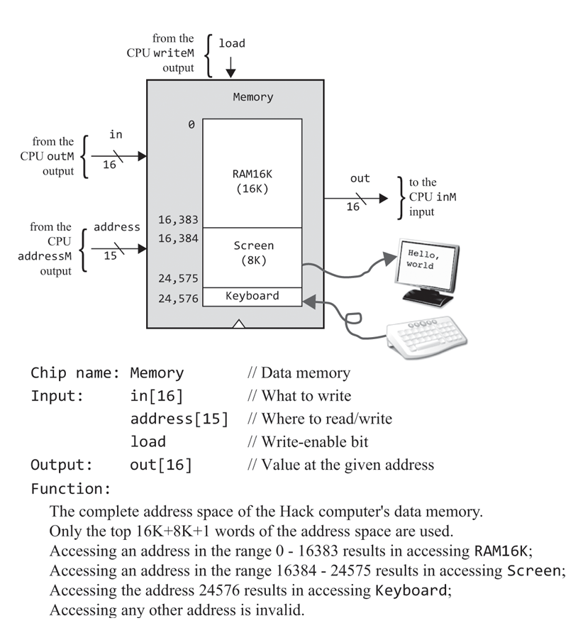

# 五、计算机体系结构

> Here is a machine with a finite
> and fixed hardware that can perform an infinite number of tasks, from
> playing games to typesetting books to driving cars.

## 总结

本章是对前四章的综合运用，为第四章的理论提供硬件基础。许多细节动手做一遍会有更清晰深刻的理解。

### 程序

将指令语句依序存储下来，构成程序。固定的硬件可以运行无限的软件，带来丰富的可能性。

### 冯-诺伊曼结构

相比图灵机更具实用性。由CPU和内存构成。若程序和数据可分别由不同存储器构成，则称为Harvard architecture。

### I/O

将I/O设备映射至一段内存中，计算机就可以通过操作内存的方式连接外设。

#### 屏幕

由一块8KRAM模块驱动，构成系统内存的一部分。(Q: 物理内存？虚拟内存？)

驱动软件在后续的操作系统章节中介绍。

#### 键盘

一个只读寄存器。

### Boot

设置程序计数器，从ROM中获取指令开始执行。

现代PC应是从主板固件(ROM)中启动，从硬盘中读取操作系统至内存，进而进入系统。

## 代码

CPU设计稍有难度。VScode对这个语言应该没有语法高亮，比较不方便。注意索引0对应LSB。

提供的测试程序和正确结果显著降低了开发难度。

最后把三个部分组合起来的时候还有点小激动，年轻人的第一台自制计算机。
