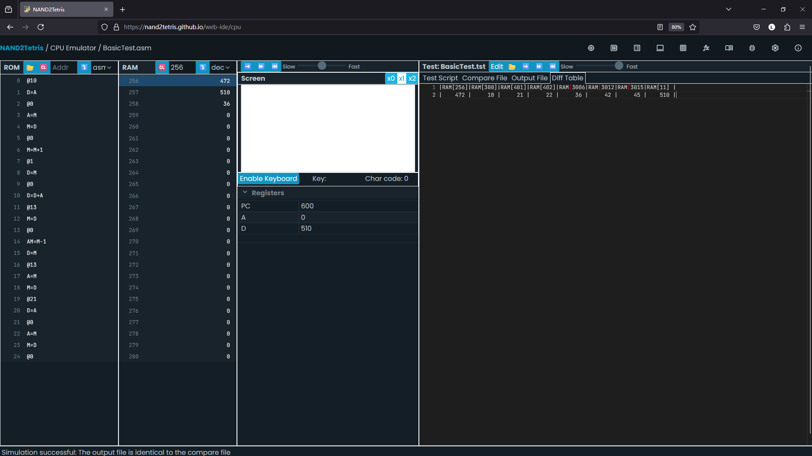

# 七、虚拟机 Ⅰ

> First, the notion of having one computing
> framework emulate another is a fundamental idea in computer science,
> tracing back to Alan Turing in the 1930s.

## 虚拟机

- 虚拟机结构引入了一个中间层，将程序的执行拆分为两个独立的步骤：1、将高级语言代码翻译为虚拟机代码；2、在硬件平台上运行虚拟机代码。

    过程的第一步只和所用高级语言有关，第二步只和目标机器有关。

- 第7和第8章实现的是第二部分，这部分也常被称为编译器后端。第二部分的实现又可分为两种方式：静态编译和动态解释。

    - 静态编译直接将虚拟机的中间指令翻译为目标机器的硬件指令。

        静态编译的主要优势是性能。

        C++, Rust, Go等语言都采用了静态编译的方式。其中LLVM是一个通用的静态编译器框架，C++的Clang编译器和Rust的编译器都使用了LLVM后端。

    - 动态解释则是在目标机器上运行一个解释器，将虚拟机的中间指令翻译为目标机器的硬件指令并执行。

        动态解释的优点是程序的分发变得更加高效，一份虚拟机代码可以在不同的硬件平台上运行。

        同时，多种高级语言可以共享同一个虚拟机，实现生态的复用。

        此外，动态解释语言通常会结合即时编译技术，将热点代码编译为硬件指令，提高性能。

        JAVA, C#, Python等语言都采用了动态解释的方式。Kotlin共享了JAVA的虚拟机JVM，而.NET语言共享了C#的虚拟机CLR。

    - 虚拟机常见的两种实现是基于栈的虚拟机和基于寄存器的虚拟机。

        基于栈的虚拟机更容易实现，因为栈的操作是线性的，而寄存器的操作是并行的。

        基于栈的虚拟机的指令集更简单，但性能更低。

        基于寄存器的虚拟机的指令集更复杂，但性能更高。

## 栈

- 在RAM的硬件基础上，通过对内存地址的操作，可以建立起数组和链表这样的基础数据结构。

- 栈与数组和链表不同，是一种抽象的数据结构。栈只通过压入和弹出两种操作来改变栈顶的值，但已经足够表达任何代数和逻辑计算。

    栈在表达嵌套和递归的结构时简洁有效。

    例如，`d = (2 - x) + (y + 9)`可以被表达为`push 2, push x, sub, push y, push 9, add, add, pop d`。

## 编译器

- 虚拟机的一种实现方式是通过一个编译器，将虚拟机指令写成的程序编译为目标机器的硬件指令。

- 编译器需要把抽象的栈内存对应到物理内存的地址。

    具体而言，HACK可以将内存的0-15用作虚拟寄存器，用于存放各个虚拟内存段的起始地址值，16-255作为程序的静态变量存储区，256-2047作为栈区。

- 在汇编器的实现中，SP被作为保留的符号关键字，绑定到了RAM[0]，用于存放栈顶指针。`push x`就可以被编译为`@SP, A=M, M=x, @SP, M=M+1`。

## 虚拟机实现

- 要将虚拟机实现为HACK代码，首先需要读懂VM代码。

    本章只实现`push`/`pop`以及代数逻辑命令。

    VM的核心是栈，栈会被映射为一片连续的物理内存，由一个栈顶寄存器指针追踪。

    在书里给出的参考实现中，栈顶指针默认初始化为内存的256地址。

    除了全局的栈区域外，VM还设计了多个虚拟内存区域用于存储数据。

- `push`/`pop`命令的语法为`push segment index`/`pop segment index`，其中`segment`表示虚拟内存区域，`index`表示相对于该区域的偏移量。

    例如，`push constant 17`表示将17压入栈顶，`pop local 0`表示将栈顶元素弹出并存入local区域的第一个位置。

    虚拟内存区域的起始物理地址不通过VM程序指定，一个VM程序可能只是一个子函数或者一小段代码片段。

    VM程序会假设已经存在这些虚拟内存区域，并直接对其进行操作。

- 在网页端IDE中，VM模拟器会直接加载一个文件夹里的所有.vm文件，并将它们读取为一个连续的VM程序。

    使用VM模拟器时，需要加载对应的测试脚本，用于初始化虚拟内存区域。

- 推荐先通过VM模拟器调试观察VM指令对虚拟内存和物理内存的操作逻辑，再进行HACK代码的实现。

- 在实现的过程中，也可以通过VM指令到汇编指令的开销来对这种中间层的性能代价有一个直观的认识。

### push/pop

- 观察VM虚拟机的内存，可以发现，push操作只会从虚拟内存中读取值，而pop操作只会向虚拟内存中写入值。

- pop操作需要从栈顶读出数据，计算出目标区域的物理地址，并将数据写入。该操作在实现时可能需要引入辅助寄存器（R13）。

#### Pointer区域

- Pointer区域是一个特殊的区域，用于存放THIS和THAT区域的起始地址。

    在VM中，this和that是两个特殊的虚拟内存区域，用于存放对象的地址。

- `push pointer 0`等于将RAM[3](THIS)的值压入栈顶，`pop pointer 0`等于将栈顶的值写入RAM[3]。

#### Static区域

- Static区域同样是一个特殊的区域，用于存放全局静态变量。Static区域会使用物理地址16~255。

    书中给出的实现机制是利用汇编器的自定义符号机制，该机制会按照自定义符号的出现顺序为其从RAM[16]开始分配地址。

- VM需要实现的符号命名规则是`filename.index`，例如`Main.0`。

    在下一章中可以看到，这种命名规则允许我们在多个vm文件中定义同名的静态变量，并将它们编译为一个程序，而不会发生冲突。

- 这里的汇编实现也可以帮助理解C/C++中的static关键字的实现机制。

### 代数逻辑命令

- 比较大小的逻辑实现比较复杂，需要通过跳转指令来实现，为此需要引入自定义的标签。

- 这里也可以考虑使用单独的代码段来处理true和false的写入，但这种函数调用的设计所使用的汇编指令过多，需要两次跳转，还要处理返回地址。

    本项目最终提供的设计是直接在比较指令后添加专用的true和false代码段，这样可以减少跳转指令的数量。注意StackTest的cmp文件使用了-1作为true的值。

- 如果定义true为任意非0值，比较大小的逻辑表达式似乎也可以通过位运算实现，然而我并没有找到有效的实现方法。

### 测试

- 可以同时对比VM模拟器和CPU模拟器的执行过程，并检查中间的内存变化。

    注意模拟器在加载完程序后需要手动清空内存。完整的加载流程通常是：加载程序 -> 清空内存 -> 加载测试脚本 -> 运行程序。

- 汇编的debug过程较为繁琐，设计时需仔细检查。

- 网页端IDE加载VM代码时可能会提示某一行缺少'/n'，手动补上一个换行即可。

