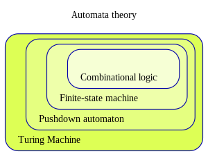

# 七、虚拟机 Ⅰ

> First, the notion of having one computing
> framework emulate another is a fundamental idea in computer science,
> tracing back to Alan Turing in the 1930s.

## Virtural Machine

虚拟机的概念将程序的编译拆分为两个独立的步骤：1、将高级语言代码翻译为虚拟机代码；2、在硬件平台上运行虚拟机代码。过程的第一步只和所用高级语言有关，第二步只和目标机器有关。[脚本语言](https://en.wikipedia.org/wiki/Scripting_language)更进一步，两次翻译都由解释器动态执行。这一编译方式的好处是，后续发布的硬件平台可以支持任意已有的软件。Python, .NET, JAVA都用了虚拟机的编译模式，其中.NET框架还将多种高级语言编译为相同的中间语言。C++则同时支持传统的高级语言到机器码的直接编译和虚拟机模式的二次编译。

<!-- ## JAVA

JAVA的设计目的之一，是让程序可以在任意平台运行。因此JAVA程序的编译结果是JAVA字节码，通过JAVA虚拟机运行。 -->

## 自动机理论

在组合逻辑中加入时序，可构成有限状态机。

## Stack Machine

寄存器机(Register machine)和堆栈机(Stack machine)都是图灵完备的计算机结构。与寄存器机不同，堆栈机的指令不包括地址。栈采用压入弹出(push/pop)的方式交互数据，数据后入先出(LIFO) 。算术和逻辑表达式被翻译成一系列栈指令，栈的不同计算指令会将一个或多个操作数替换为一个结果。表达式执行完毕后，栈中只留下一个计算结果。
