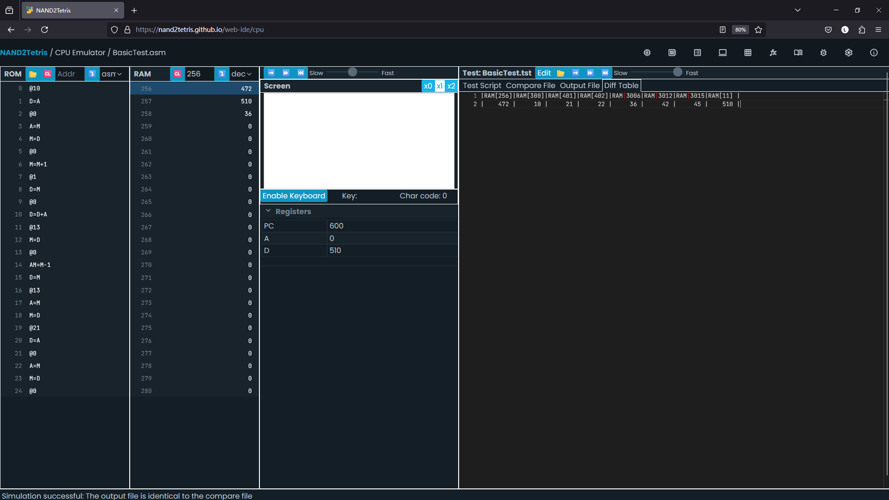

# 七、虚拟机 Ⅰ

> First, the notion of having one computing
> framework emulate another is a fundamental idea in computer science,
> tracing back to Alan Turing in the 1930s.

## 虚拟机

虚拟机结构引入了一个中间层，将程序的编译拆分为两个独立的步骤：1、将高级语言代码翻译为虚拟机代码；2、在硬件平台上运行虚拟机代码。过程的第一步只和所用高级语言有关，第二步只和目标机器有关。

Python, .NET, JAVA都用了虚拟机的编译模式，其中.NET框架还将多种高级语言编译为相同的中间语言。C/C++中的LLVM编译器也采用了类似的结构。

## 栈

在RAM的硬件基础上，通过对内存地址的操作，可以建立起数组和链表这样的基础数据结构。

栈与此不同，是一种抽象的数据结构。栈只通过压入和弹出两种操作来改变栈顶的值，但已经足够表达任何代数和逻辑计算。栈在表达嵌套和递归的结构时简洁有效。

例如，`d = (2 - x) + (y + 9)`可以被表达为`push 2, push x, sub, push y, push 9, add, add, pop d`。

## 编译器

虚拟机的一种实现方式是通过一个编译器，将虚拟机指令写成的程序编译为目标机器的硬件指令。

编译器需要把抽象的栈内存对应到物理内存的地址。

具体而言，HACK可以将内存的0-15用作虚拟寄存器，用于存放各个虚拟内存段的起始地址值，16-255作为程序的静态变量存储区，256-2047作为栈区。

在汇编器的实现中，SP被作为保留的符号关键字，绑定到了RAM[0]，用于存放栈顶指针。`push x`就可以被编译为`@SP, A=M, M=x, @SP, M=M+1`。

## 虚拟机实现

要将虚拟机实现为HACK代码，首先需要读懂VM代码。

本章只实现`push`/`pop`以及代数逻辑命令。

VM的核心是栈，栈会被映射为一片连续的物理内存，由一个栈顶寄存器指针追踪。

在书里给出的参考实现中，栈顶指针默认初始化为内存的256地址。

除了全局的栈区域外，VM还设计了多个虚拟内存区域用于存储数据。

`push`/`pop`命令的语法为`push segment index`/`pop segment index`，其中`segment`表示虚拟内存区域，`index`表示相对于该区域的偏移量。

例如，`push constant 17`表示将17压入栈顶，`pop local 0`表示将栈顶元素弹出并存入local区域的第一个位置。

虚拟内存区域的起始物理地址不通过VM程序指定，一个VM程序可能只是一个子函数或者一小段代码片段。

VM程序会假设已经存在这些虚拟内存区域，并直接对其进行操作。

在调试时，除了需要加载程序外，也需要加载对应的测试脚本，用于初始化虚拟内存区域。

在网页端IDE中，VM模拟器会直接加载一个文件夹里的所有.vm文件，并将它们读取为一个连续的VM程序。

VM模拟器需要同时加载对应的测试脚本，用于初始化虚拟内存区域。

推荐先通过VM模拟器调试观察VM指令对虚拟内存和物理内存的操作逻辑，再进行HACK代码的实现。

VM指令到汇编指令的指令开销也直观地体现了这种抽象的性能代价。

### push/pop

观察VM虚拟机的内存，可以发现，push操作只会从虚拟内存中读取值，而pop操作只会向虚拟内存中写入值。

pop操作需要从栈顶读出数据，计算出目标区域的物理地址，并将数据写入。该操作在实现时可能需要引入辅助寄存器（R13）。

#### Pointer区域

Pointer区域是一个特殊的区域，用于存放THIS和THAT区域的起始地址。在VM中，this和that是两个特殊的虚拟内存区域，用于存放对象的地址。

`push pointer 0`等于将RAM[3](THIS)的值压入栈顶，`pop pointer 0`等于将栈顶的值写入RAM[3]。

#### Static区域

Static区域同样是一个特殊的区域，用于存放全局静态变量。Static区域会使用物理地址16~255。

书中给出的实现机制是利用汇编器的自定义符号机制，该机制会按照自定义符号的出现顺序为其从RAM[16]开始分配地址。

VM需要实现的符号命名规则是`filename.index`，例如`Main.0`。

### 代数逻辑命令

比较大小的逻辑实现比较复杂，需要通过跳转指令来实现，为此需要引入自定义的标签。

注意StackTest的cmp文件使用了-1作为true的值。

### 测试

可以同时对比VM模拟器和CPU模拟器的执行过程，并检查中间的内存变化。

注意模拟器在加载完程序后需要手动清空内存。完整的加载流程通常是：加载程序 -> 清空内存 -> 加载测试脚本 -> 运行程序。

汇编的debug过程较为繁琐，设计时需仔细检查。

