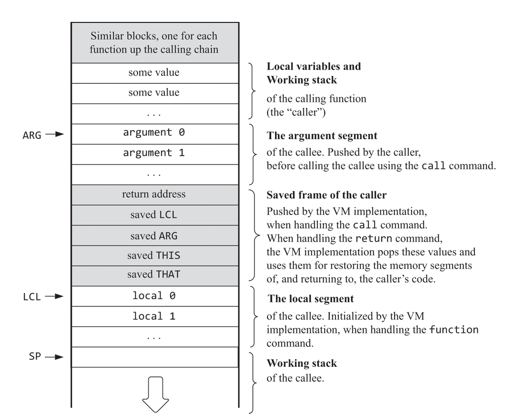
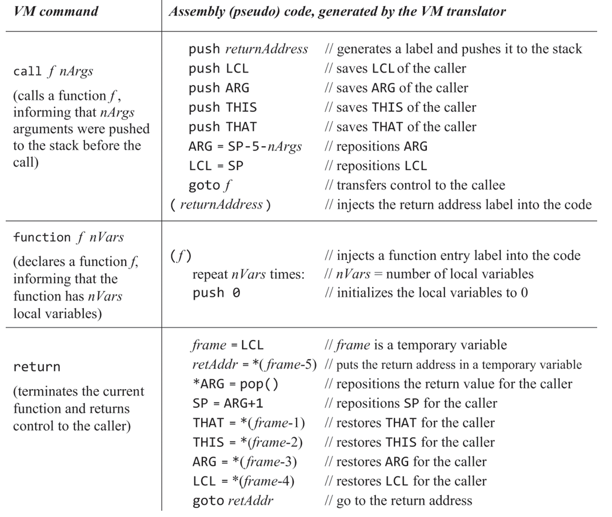
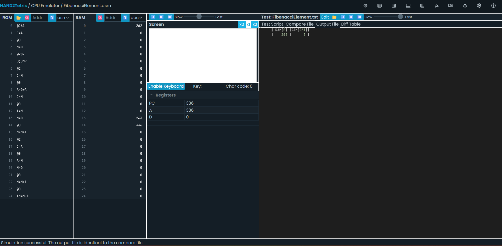

# 八、虚拟机II

> The unlimited capacity to extend the language at will is one of the most
> important features of high-level programming languages.

本节将完成完整的编译器后端设计，将前端从高级语言翻译而来的中间代码编译成目标机器的汇编代码。

- 中间语言实际上既不直接面向开发者，也不直接面向机器，因此设计规范上具有很大的灵活性。

- 本节主要是在上一章的基础上加入跳转/条件跳转指令，以及函数调用/返回指令。

- 在实现函数调用后，我们就可以给系统加入启动引导过程，不需要再依赖测试脚本来初始化硬件状态。

    硬件在上电后会执行固定的启动引导程序，初始化内存，再调用主函数。

    由于引入了启动引导，因此代码的执行流是受控的，函数体只会在被调用时从标签处开始执行，并最终通过`return`指令返回。

    这也意味着代码块的顺序可以是任意的，函数代码可以位于任意位置，只要在调用时能找到对应的标签即可。

    代码顺序的任意性也意味着我们可以引入多文件编译，由编译器将多个vm文件编译成一个汇编文件。

## 跳转指令

跳转指令包括`label`，`goto`和`if-goto`三种。在之前的基础上实现这三种命令较为简单，只需直接写入对应的汇编代码即可。

- 测试跳转指令的文件位于`ProgramFlow`目录下。建议先实现跳转指令再实现函数调用。

- 由于此阶段还没有实现函数功能，这里的label可以直接使用输入代码中的label名称，不需按照Figure 8.6中的`FunctionName$label`格式。

## 函数调用

编译器后端需要插入额外的汇编指令，来实现函数声明、调用和返回需要的栈操作。

- 从调用者的视角看，在使用VM指令调用函数时，调用者需要提前将参数压入栈中，然后调用`call f nArgs`指令，其中`f`是函数名，`nArgs`是参数个数。

    在调用指令后，调用者会继续执行下一行代码，同时会看到栈中的入参被清空，返回值位于栈顶，且自己的各个内存区域保持不变。

- 从被调用者的视角看，可以看到自己的ARG区域内存放着调用者传入的参数，且LCL区域内保存着被初始化的局部变量。

    被调用者需要在调用返回语句前，将返回值压入栈中，然后执行`return`指令。

---

函数调用部分实现较为复杂，好在书中给出了具体的伪代码实现。后端编译器需要通过指令完成的额外动作如图所示。

- 在调用函数时，返回地址以及四个虚拟内存区域的基址会被压入栈中。

    ARG区域的基址会被设置为`SP-5-nArgs`，即栈顶-5个地址-参数个数，使其指向首个调用者压入的参数。

    LCL区域的基址会被设置为`SP`。

    在写入跳转指令后，还需写入返回地址标签。这个标签就是上方压入栈中的返回地址。汇编器的实现允许我们先访问后声明标签。

- 在声明函数时，编译器需要为后续的代码段引入一个入口标签，并在函数开始执行时先初始化LCL区域。

    初始化LCL区域的过程同时也将栈顶指针向前推进，使得局部变量区域不会覆盖栈。

- 在函数返回时，需要将返回值存放到ARG区域的基址处，这是调用者开始压入函数参数的位置，并将SP设置为ARG区域的基址+1。这样，调用者就会看到调用前压入栈中的入参变为了返回值。

    LCL的基址向前依次存放着调用者的基址和返回地址，将其写入对应的基址寄存器中即可还原调用者的内存状态。

    **当函数的入参数量为0时，ARG区域的基址和returnAddress会重叠，所以必须先将returnAddress存入临时变量，再将返回值存入ARG基址。**

### 命名规范

为了使不同的函数和文件可以在内部使用同名的标签，实现类似命名空间的效果，标签和符号中需要加入文件名和函数名。

这与之前静态变量引入文件名进行命名的`Xxx.i`格式类似。

- 函数的命名格式为`Xxx.functionName`，其中`Xxx.functionName`是函数名。文件名前缀应当是由前端编译器生成的。

- 标签的命名格式为`functionName$label`，其中`label`是标签名。

- 返回地址的命名格式为`functionName$ret.i`，其中`i`是计数值。这是由于一个函数内可能多次调用其他函数，而每次调用都需要一个不同的返回标签。

    **注意这里的函数名应当是当前函数名而非将要调用的函数名，这样我们才能在不同的函数内调用相同的函数并且不会发生标签冲突。**

- static变量的命名格式为`fileName.varName`，其中`fileName`是文件名。这种文件域的命名空间与C类似。

## 引导程序

*函数调用部分完成后可先使用SimpleFunction进行测试，之后再实现引导程序。*

- 如果出现了重名的标签，网页端IDE会报错，但本地编译器不会报错，因此需要注意。

- 引导程序的实现需要在汇编代码的开头插入一段代码，用于初始化内存和调用主函数。

    实际上，由于我们不会从sys.init返回（sys.init最后会写一个死循环），因此sys.init其实不需要保存基地址，也不需要返回地址。

    但是测试脚本仍然以SP261作为sys.init函数内的栈顶地址，因此我们需要在引导程序中将SP设置为261而非256。

---

汇编指令的调试难度极大。一个技巧是在调试复杂的函数调用时，只关注栈内存的变化，通过当前栈顶的参数来定位程序处于哪个状态。

我们用门电路实现了计算斐波那契数列的机器！