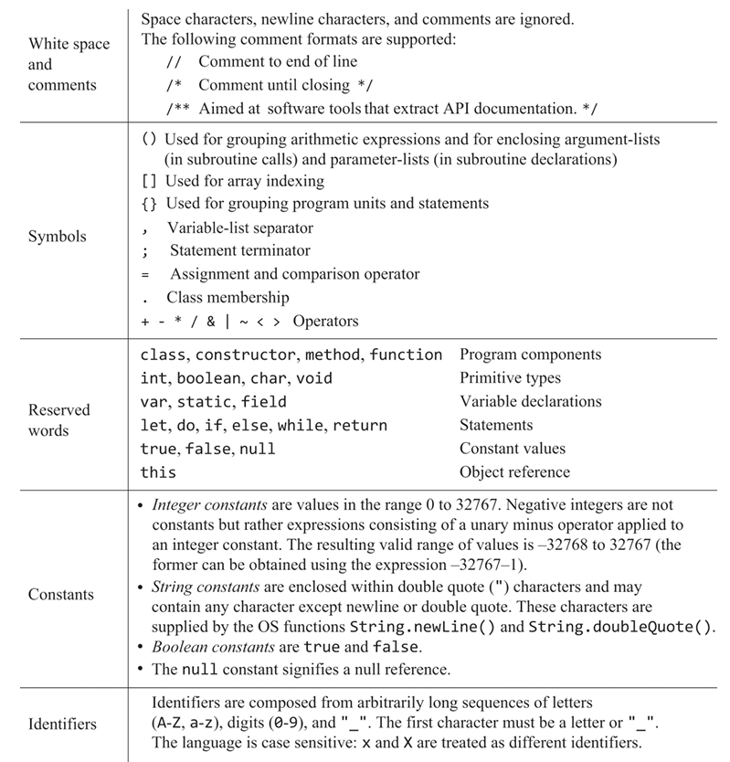
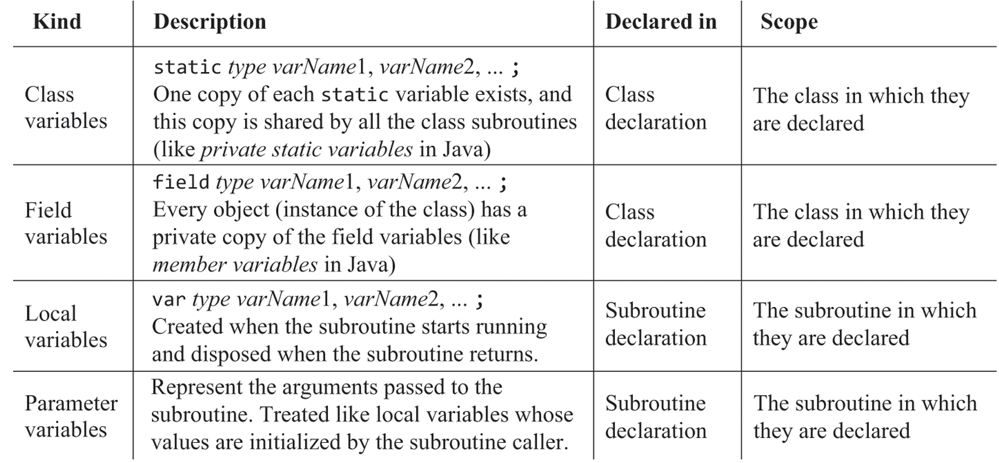
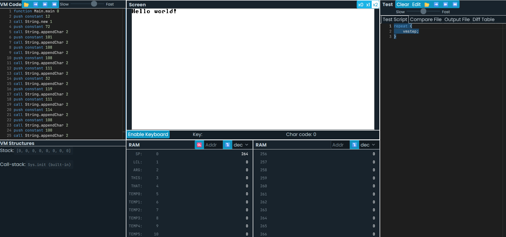

# 九、高级语言

> Instead of viewing the constraints imposed by the host platform as a problem, 
> professionals view it as an opportunity to display their resourcefulness and ingenuity.

本节的核心是熟悉Jack这门语言，为后续的编译器和OS开发做准备，与第四章的定位相似。

## Jack

Jack拥有一门现代高级语言最基本的功能，包括变量、表达式、控制流、函数、类、对象等。

然而，为了降低前端编译器的实现复杂度，Jack在多处细节上选择了尽可能简单的实现方式：

1. 表达式没有优先级，必须使用括号明确优先级。
2. 只有三种内置类型：int, char, boolean，数组、字符串通过OS的API对象实现。
3. 没有垃圾回收，对象需要手动释放。
4. 构造方法必须显式返回：`return this`。
5. 语句的开头会使用关键字显式声明语句功能，包括`do`, `let`, `if`, `while`, `return`。

此外，Jack还融合了C和JAVA的许多特性和习惯：

1. 每个类必须在一个独立的文件中定义，文件名与类名相同。
2. 允许将整数变量作为内存地址使用。

Jack共有4种变量类型：`Class`, `Field`, `Local`, `Parameter`。

## OS

OS的API对象提供了一些基本的功能，包括：`Math`, `String`, `Array`, `Output`, `Screen`, `Keyboard`, `Memory`, `Sys`。

和HDL的实现一样，当模拟器在代码中找不到OS API的实现时，会调用内置的实现。

## Bitmap

提供的工具中还包括了一个BitmapEditor，用于编辑位图文件。

编辑好的位图文件通过生成的draw函数可以直接将内容写入对应的内存，这比调用OS的绘制函数效率更高。

## 编译Jack

附赠的工具中提供了Jack compiler，用于将Jack代码编译为VM代码。

与其他的模拟器工具不同，compiler是一个命令行工具。

windows下使用`compiler.bat /？`可以看到帮助信息。

查看bat文件内容，可以看到实际上是调用了bin中的JAVA class文件。

使用第二个参数输入文件夹路径，可以将文件夹中的所有jack文件编译为VM代码。

指定路径的方式有可能遇到问题，可以将compiler和bin文件夹以及直接放置在jack代码文件夹根目录中，然后直接运行`compiler.bat`进行编译。

将编译后的文件夹上传到VM模拟器中，即可运行编译后的程序。VM模拟器的执行VM代码时的性能已经足够运行游戏这样的交互式应用了。

也可进一步使用VM translator将VM代码翻译为汇编代码，再使用汇编器将汇编代码翻译为二进制代码，并使用硬件模拟器运行。