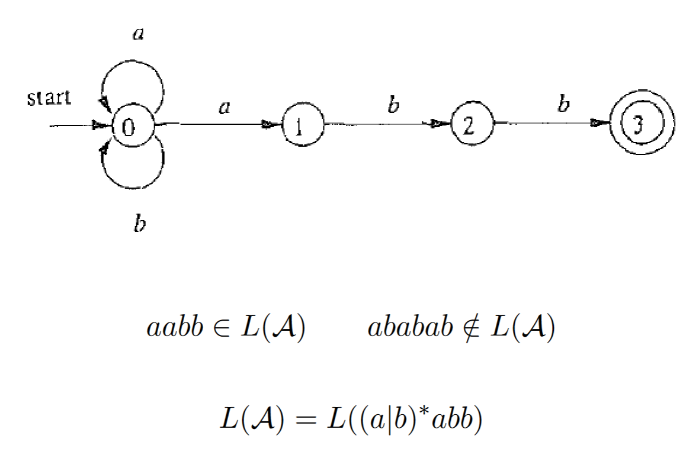
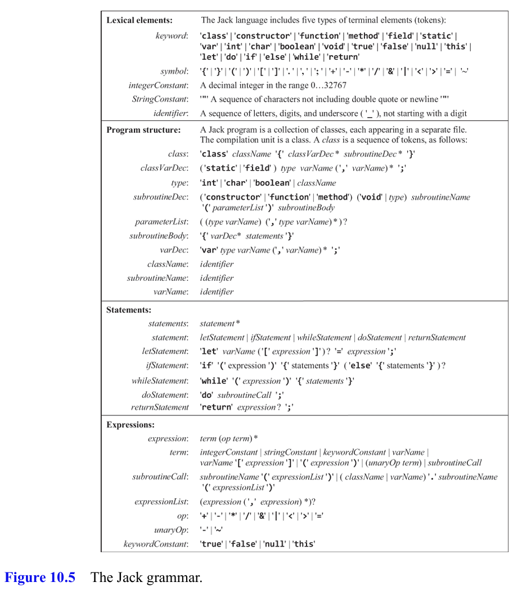
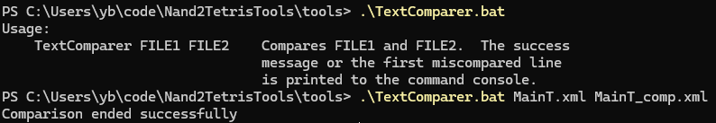

# 十、编译器I

> Thus, while most programmers don't develop compilers in their regular jobs, many programmers have to parse and minipulate texts and data sets of complex and varying structures.

第十和第十一章的内容是完成编译器前端的开发，将高级语言代码编译为中间语言。如何将一种符号序列，按照一定的规则解析和翻译为另一种符号序列，是一个普遍的问题。

- 与之前的惯例一样，本书的每一章会先介绍通用的思想和理论，之后再结合具体的语言来实现。

- 从汇编器到后端编译器再到前端编译器，输入解析部分的复杂都增加了一个层次。

    汇编指令到机器码的翻译是一一对应的。

    后端编译器的输入是中间语言构成的逐行的代码序列，对输入的解析仍然相对简单，复杂的部分主要是在输出时需要将抽象的中间代码翻译为对应的汇编指令。

    前端编译器的输入是高级语言代码，输入中可能包含层级嵌套的语法结构。

    高级语言的抽象使得我们可以用形式化的语法规则来描述语言的结构，这也是编译原理课程的重点内容。

- 本章的目标是实现前端编译器中的解析部分，旨在将输入的高级语言代码转换为结构化的词法树。生成目标语言代码的部分留在下一章实现。

## 分析器

对代码的分析通常包含两个步骤构成：词法分析和语法分析。

### 词法分析

词法分析将输入的代码分解为单词，这些单词是代码的基本元素，如关键字、标识符、常量等。

词法分析通常由状态机或正则表达式来实现。

正则表达式实际上也可以被转化为一个非确定有限自动机（Nondeterministic Finite Automata, NFA）。

NFA意味着在某个状态输入某个符号时可以有多条状态转移路径。



词法分析中需要引入的一个概念是最长匹配原则，即在多个匹配的情况下，选择最长的匹配。例如，对于`if`和`ifelse`两个关键字，如果输入的代码是`ifelse`，则应该匹配为一个`ifelse`关键字，而不是一个`if`关键字和一个`else`标识符。

### 语法分析

语法分析将单词按照语法规则组织成结构化的树形结构，这个结构被称为词法树。

语法分析通常由一种表达能力严格强于正则表达式的文法：上下文无关文法（Context-Free Grammar, CFG）来描述。

#### 上下文无关文法

上下文无关文法（Context Free Grammar, CFG）定义为一个四元组：`G = (N, T, P, S)`，其中`N`是非终结符集合，`T`是终结符集合，`P`是产生式规则集合，`S`是开始符号（$S\in N$且唯一）。

产生式规则的形式是`A -> α`，其中`A`是一个非终结符，`α`是一个符号串，可以是终结符、非终结符或空串。

例如，下面是一个简单的四则运算文法的产生式规则：

```text
E -> E + E | E * E | (E) | -E | id
```

推导即是将某个产生式的左边替换成它的右边。每一步推导需要选择替换哪个非终结符，以及使用哪个产生式。

例如，要产生$\{b^na^mb^{2n}|n\geq 0, m\geq 0\}$，可以使用如下的产生式规则：

```text
S -> bSbb | A
A -> aA | ε
```

通过引入新的非终结符`A`，可以将产生的过程分解为两个步骤：首先产生`bSbb`，然后将`S`替换为`A`，再产生`aA`。

上下文无关意味着产生式规则的左边（Head）只包含一个非终结符。如果存在多个非终结符，一个符号的推导可能依赖于其他符号，这种文法被称为上下文相关文法。

#### LL(1)文法

Jack是一种LL(1)语言，即从左到右读入词法单元，每次选择最左边的非终结符展开推导。

这种语言的语法分析器可以使用递归下降法（recursive decent）来实现。

递归下降法是一种自顶向下的解析方法，即从根节点开始，递归地向下解析每个子节点。

递归下降的典型实现框架是：

```c
void A() {
    选择一个产生式，A->X1X2...Xn
    for (i=1; i<=n; i++) {
        if (Xi是非终结符) {
            调用Xi()
        } else if (Xi等于当前输入符号) {
            匹配Xi
        }
        else {
            报错
        }
    }
}
```

选择产生式的方法是通过预测分析表（Predictive Parsing Table）来实现。例如：

```text
S -> F
S -> (S + F)
F -> a
```

可以建立如下的预测分析表（$表示输入的结尾）：

|     |  (  |  )  |  a  |  +  |  $  |
| --- | --- | --- | --- | --- | --- |
|  S  |  2  |     |  1  |     |     |
|  F  |     |     |  3  |     |     |

当读入的符号是`(`时，选择第二条产生式`S -> (S + F)`；当读入的符号是`a`时，选择`S -> F`。若查到表中的单元格为空，意味着输入不符合文法，需要报错。

如果可以建立一个无冲突的预测分析表，那么这个文法是LL(1)的。

我们可以通过数学推导建立一个LL(1)文法的预测分析表，其流程为：

1. 建立FIRST集合：对于每个非终结符，找到它的FIRST集合，即它允许从输入中读入的当前符号集合。
2. 建立FOLLOW集合：对于每个非终结符，找到它的FOLLOW集合，即它允许在推导中出现的下一个符号集合。
3. 若非终结符的FIRST集合中包含对应终结符，则将其规则加入预测分析表中；若FIRST集合中包含空串，则将空串规则也加入FOLLOW符号的栏中。

在上述例子中，$ \text{FIRST}(S) = \{(, a\}, \text{FIRST}(F) = \{a\}, \text{FOLLOW}(S)=\{+, \$ \}, \text{FOLLOW}(F)=\{+\}$。

- 除了递归下降外，也可以使用基于栈的非递归形式实现LL(1)文法的解析器。

## 输出

- 书中选择使用XML来表示这种结构化的词法树。XML是一种通用的标记语言，与HTML类似，使用标签来描述文档的结构。XML的标签是成对出现的，有开始标签和结束标签，中间可以包含文本或其他标签。例如：

    ```xml
    <book>
        <title>The Elements of Computing Systems</title>
        <author>Noam Nisan and Shimon Schocken</author>
    </book>
    ```

## 实现

书中给出的解析器的参考设计同样分为三个部分：`Analyzer`、`Tokenizer`和`CompilationEngine`。

- `Analyzer`是解析器的入口，负责读取输入文件，调用`Tokenizer`来将输入的代码分解为单词，然后调用`CompilationEngine`来将单词转换为词法树。

### 词法解析

解析器的主要工作是完成词法单元的切分和类型识别。

    Tokenizer如果使用正则逃课则较为简单，可以使用Python的re库来实现`Tokenizer`。

    注意注释的语法有三种：`//`、`/* */`和`/** */`，其中多行注释的匹配自然包含了API注释`/** */`的匹配。

- 同时，本项目给出了使用C++（Cpp17）实现的手写词法解析器。

### JACK语法



Jack语法的推导从Class开始，Class包含了ClassVarDec和SubroutineDec。SubroutineDec包含了Function和Method，Function包含了FunctionName、ParameterList、FunctionBody等。

- 语法解析的实现基本按照给出的API逐个实现即可。书中的设计通过高度的抽象和递归，将复杂的语法结构分解为简单的递归调用。

- Jack中一处不符合LL(1)文法的特例是term语句。term语法中无法仅通过当前符号判断要选择的产生式，此时需要向前看一个符号。此时有可能在消耗掉第一个id之后开始处理subroutineCall，因此这不适合作为一个完整的API实现。

- 由于Cpp的标准库没有内置的XML库，我们选择手动输出xml格式的文本，忽略了缩进，可以使用排版插件排版后再和测试用例对比。

## 测试

- 参考资料中给出了测试用的jack代码和对应的XML输出，可以用来验证编译器的正确性。



- 也可以直接使用编辑器（VSCODE）的compare功能来比较两个XML文件的差异。

## 补充

- 实际上，解析器的代码通常会由另一个程序来生成。开发者将语法规则输入到对应的工具中，并生成对应的解析器。这种工具被称为编译器生成器。常用的编译器生成器有ANTLR、Yacc等。

- 书中绕过的一个关键内容是编译中的错误检查。在实际的编译器中，我们需要对输入的代码进行各种检查，如类型检查、语法检查、语义检查等。这些检查通常会在解析的过程中进行。