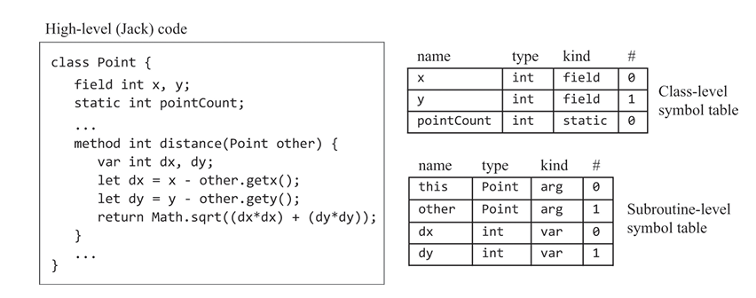
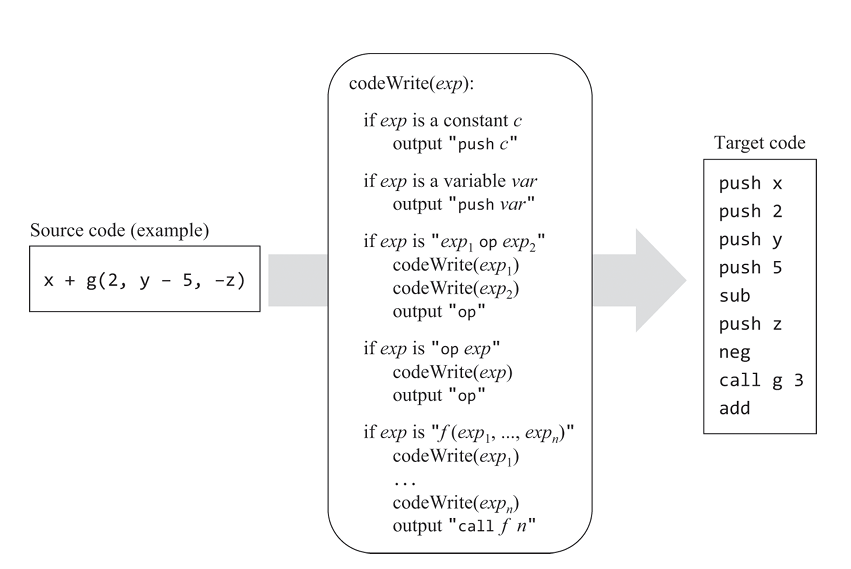
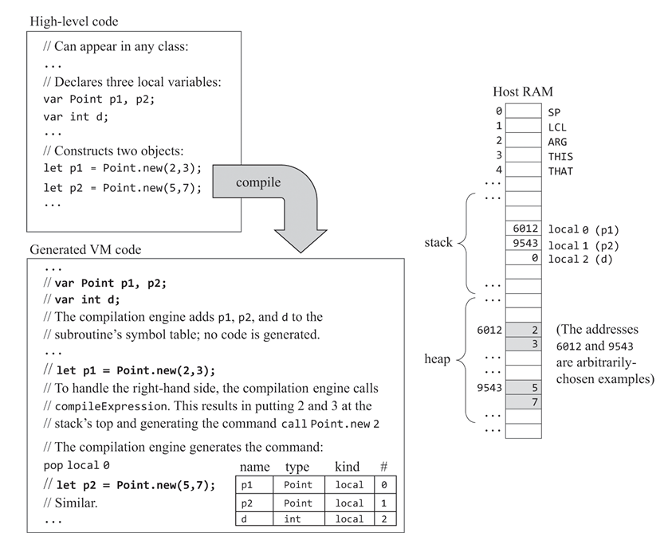
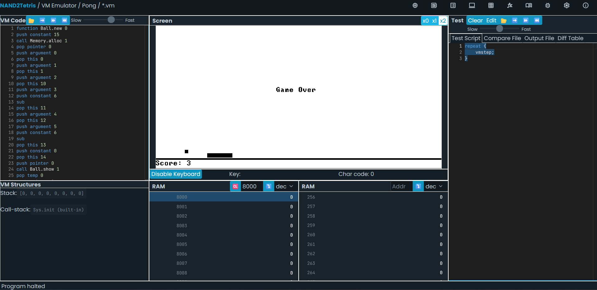

# 十一、编译器II

> Most programmers take compilers for granted. But if you stop to think about it, the ability to translate a high-level program into binary code is almost like magic.

本章的目标是实现JACK语言编译器前端中的代码生成部分。第十章完成了JACK语言编译器前端的解析部分，将输入的高级语言代码转换为结构化的词法树。本章的目标是将词法树转换为目标语言代码。

本节涉及变量名称表的设计，各种语法的翻译，编译器对操作系统API的调用，以及对面向对象语言的编译。

## 变量名称表

在VM语言中实际上没有用户自定义的变量名称的概念，只有栈操作。但在高级语言中，变量名称是一个重要的概念。编译器需要将变量名称映射到内存地址，以便在编译时和运行时能够正确地访问变量。

由于目标语言是VM语言，我们需要映射的目标内存也是VM中的虚拟内存，即`static`、`this`、`local`、`argument`等。

此外，子程序（函数/方法）的参数和局部变量也需要映射到VM的内存中。

## 表达式

## 对象

在VM语言这样的面向过程的语言中，需要存储的数据只有全局变量，函数的局部变量，以及函数的参数和返回值。一个单向增长的栈结构足以存储这些数据。每次函数调用时，栈需要分配的内存大小都是可以在编译时确定的，因此栈的内存分配是静态的。

对象则实现了一套新的抽象，我们希望对象可以独立于函数调用而存在，并且在运行时动态创建。这就需要新的内存分配机制。我们可以在OS中，实现一个在内存的另一侧动态分配内存的函数。这部分内存称为堆区。JACK的OS提供了`Memory.alloc(size)`函数来分配内存。

栈区变量的生命周期是跟子进程同步的，当函数返回时，栈区变量会被销毁。堆区变量的生命周期则是独立的，需要手动释放内存，或是由垃圾回收器回收。

类的构造方法创建对象时，会通过内存的堆区分配内存。当调用构造方法创建对象时，当前栈内得到的是对对象的引用，即对象的内存地址。

我们在汇编器和编译器后端中都保留了THIS和THAT关键词，以及对应的寄存器。并且我们在每次VM函数调用时，都会把当前函数的THIS和THAT的值保存到栈中。之前我们做的这些准备，都是为了在这一章实现对象的访问。

### 成员变量

对象由成员变量和方法构成。我们需要在内存中存储的其实只有成员变量。

当编译器遇到成员变量声明的时候，只会将变量加入到变量名称表中，而不会生成VM代码。只有当遇到构造函数的时候，才会生成VM代码，用于初始化成员变量。

成员变量的访问是通过对象的引用和偏移量来实现的。我们可以对类的成员建立一个符号表，并在创建对象时，为每个成员变量分配一个偏移量。这样，我们就可以通过对象的引用和偏移量来访问成员变量。

### 方法

VM语言，以及更底层的机器语言，都不存在对象方法的概念，我们在机器上实现的只有过程式的函数调用。编译器需要将方法的调用转换为一个一般的函数调用。

例如，`p1.distance(p2)`可以转换为`Point.distance(p1, p2)`，进而翻译为`push p1; push p2; call Point.distance 2`。

这其中的关键是，调用者总是会作为第一个参数，传递给方法函数。这也是JAVA, Python等语言实现“对象调用方法”这层抽象的奥秘。

在JACK的实现中，我们需要设计相应的VM指令，使得方法执行时，THIS寄存器指向当前对象。此外，我们在方法中访问作为参数的其他对象，这是通过THAT寄存器来实现的。

值得注意的是，JACK中并不支持直接访问另一个对象的成员属性，而是必须通过类似getter和setter的方法来访问。

## 数组

数组在JACK中实际上通过OS的`Array`类实现。由于JACK中的基本数据类型和指针大小都是16位，所以数组也没有类型限制。

实现数组访问的方式是将数组的索引作为表达式进行解析，并存储在栈顶，然后做指针的偏移计算。之后使用类似对象访问的`this 0`和`that 0`寄存器来访问数组元素。

- 这里我们必须先对数组对象的基地址做偏移计算，再使用`this 0`来访问，因为偏移量是表达式，需要在运行时计算。从汇编指令的角度看，这种实现也是高效的。

## 实现

- 实现中较大的难点是理解高级语言到中间语言，以及面向对象到面向过程的转换。
    - 源程序代码中的大量内容并不会出现在VM代码中。**一个JACK类文件编译得到的VM文件只有若干个函数，函数中只有若干栈操作和对其他函数的调用。**
### API

本章的建议API设计中引入了两个新的类：`VMWriter`和`SymbolTable`。`VMWriter`用于生成VM代码，`SymbolTable`用于存储变量名称表。
- 上一章实现的`JackTokenizer`可以完整地沿用至本章。
- `CompilationEngine`类的设计也可以沿用，但是接口内部的实现需要重写。
- 主类`JackAnalyzer`改为`JackCompiler`，但内容基本与上一章一致。

### SymbolTable

我们需要创建两个SymbolTable实例，一个用于存储当前类的符号，一个用于存储当前子程序的符号。
- 类的变量声明有`static`和`field`两种。
- `field`变量会在构造函数中初始化，并在方法调用中被编译为`push/pop this index`语句。
- `static`变量是由所有类的实例共享的静态变量。当我们在类的方法中访问静态变量时，编译器需要根据符号表将其编译为`push/pop static index`。我们在之前的编译器后端实现中，将`static index`编译为汇编指令中的`filename.index`变量，汇编器再将其编译为递增的物理地址。由于我们在汇编变量名称中加入了文件名，也就是类名，因此我们在每个类的编译中都可以从0开始为索引计数，不同类的静态变量最终会得到不同的物理地址。

### 语句

- 处理空返回值的函数时，我们需要在返回前压入一个0值：`push constant 0`，以保证栈的平衡。由于我们只能使用`do`语句调用这类函数，而且`do`语句末尾本就会加上`pop temp 0`，因此这个0值不会对程序的运行产生影响。
- 乘法和除法运算符需要通过调用OS标准库中的`Math.multiply`和`Math.divide`方法来实现。

### 字符串常量

ACK的字符串通过OS的String类实现。编译器需要先创建一个String对象，然后将源码中的字符串常量逐个转换为符号表中的对应数值，并调用`String.appendChar`方法将字符逐个添加到String对象中。
- 附录5是JACK符号表，可以发现，表中编号值小于128的符号跟ascii码一一对应。大于128的编号是一些对应键盘功能键的特殊符号，源码中不会出现。

### 类型

- JACK虽然是一门静态类型语言，但是三种基本类型`int`, `char`, `boolean`在VM语言中都是16位的。
- JACK中没有指针的概念，因为所有的自定义对象都需要通过构造器创建，这些对象变量其实都是对象的16位的内存地址，也就是指针。
因此，我们在编译器中不需要区分这三种类型，只需要将它们都编译为16位的数据即可。

### 子进程

- JACK的语法结构是`class->classVarDec* subroutineDec*`，我们只有在`subroutineDec`内的`statements`中才会开始生成VM代码。

- 子进程包括`constructor`, `method`, `function`三种类型。同时还分为子进程的定义和调用两个部分。每种情况都要注意处理的逻辑。

- 编译器需要在解析完子进程的变量声明部分后，使用`function className.subroutineName nVars`指令来声明子进程。`nVars`是子进程的局部变量个数。

- 由于对当前对象成员的访问都会被编译为`push/pop this index`，因此编译器需要插入语句，使得函数在开始执行时，THIS指向调用方法的对象/构造器返回的对象。

#### 方法

- 方法定义时，编译器需要在vm函数声明后，插入指令`push argument 0` 和 `pop pointer 0`，用于将传入的对象引用设置为THIS的地址。
- 方法调用时，编译器需要在调用前，将对象引用压入栈中。

#### 构造函数

- 构造函数定义时，编译器需要在vm函数声明后，插入指令`push constant n`，其中n是成员变量的个数，用于初始化对象的内存空间。之后，编译器需要调用OS的`Memory.alloc`函数，分配内存，并使用`pop pointer 0`将返回值设置为THIS的地址。
- 由于JACK语法规定了构造函数需要显式使用`return this`结尾，因此编译器不需要对返回做额外的处理。这本质上是在构造函数的最后使用`push pointer 0` `return`进行结尾。

## 小结

- JACK是一门类似JAVA的，完全面向对象的语言。和JAVA一样，我们规定每个程序文件都是一个类，代码通过类的方法来组织。程序执行的入口是`Main.main`函数。在本章及之前章节的内容中，我们知道每个JACK源代码都会被编译为一个对应的VM文件。同时，我们实现了将一个或多个VM代码文件构成的JACK程序，编译为HACK机器上的汇编程序的编译器后端。我们还实现了在汇编中插入代码，让程序从入口开始执行的引导部分。

- 本章提供了一个新的视角，让我们看到了这种面向对象语言在内存和代码执行中是如何实现的，如何通过动态内存分配来实现成员变量的存储，如何将对象方法的调用转换为函数调用。

- C++是一门支持面向对象的静态编译语言，C++中的对象内存分配取决于创建对象时使用的语法。如果使用变量声明的形式创建对象，对象会被分配到栈上。如果使用`new`关键字创建对象，对象会被分配到堆上。

- 在JACK中，OS API和语言的标准库是一体的，编译器前端可以直接调用这些API，用户也可以在代码中调用它们。和之前的章节一样，模拟器会先尝试读取当前目录下的OS API的VM实现文件，如果没有找到，则会调用内置的、JAVA实现的API。

- 本章中会重新注意到许多之前没注意到的，JACK语言语法中的细节。例如，VM函数声明中仅有一个nArgs参数，对应函数内局部参数的个数。而传入函数的形参，连数量都不需要出现在函数声明中。这是因为，形参已经由编译器前端在编译时转换为将变量压入栈中的指令了。

太美丽了家人们