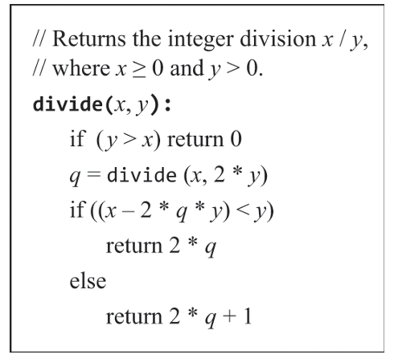
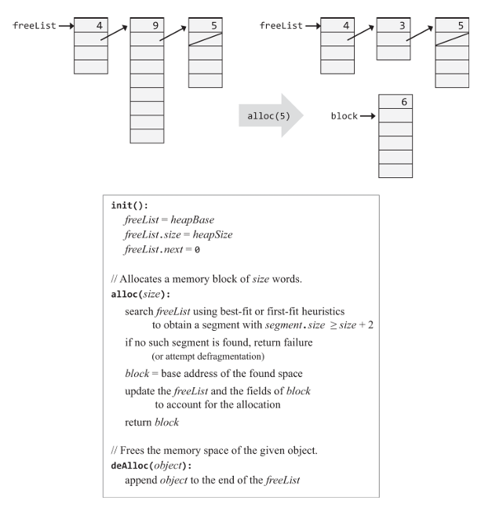
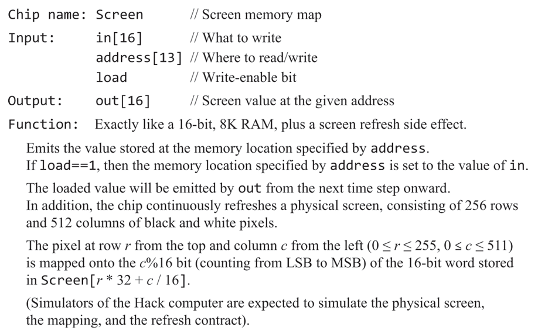
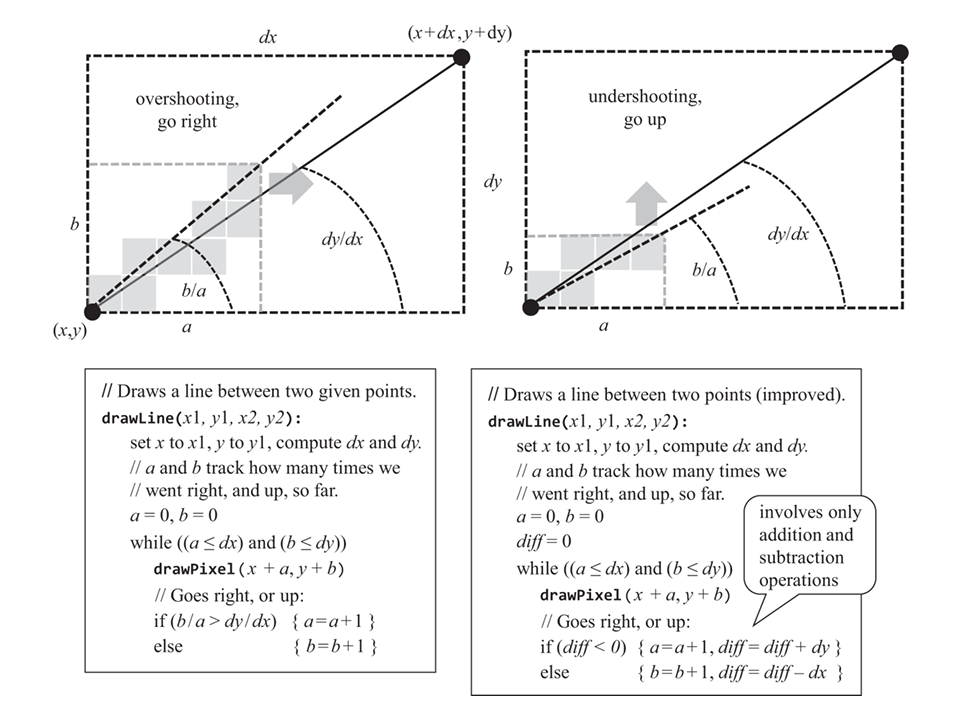

# 十二、操作系统

操作系统是软件和硬件间的桥梁。操作系统在硬件指令的基础上做了一层封装，提供了一系列的系统调用接口。操作系统的任务包括多进程调度、内存管理、文件系统、网络通信等。在一台现代计算机中，固件上电引导后会首先加载操作系统，操作系统初始化自身进程后，再进入用户态。

高级语言的标准库在操作系统的基础上再封装了一层，提供了更加方便的接口供开发者调用。语言标准库提供的基础功能包括：输入输出接口、字符串处理、数学函数、内存分配等。

HACK硬件结构简单，软件体系近似嵌入式设备。HACK硬件采用的是哈佛架构，拥有独立的指令和数据存储器，更换程序只能通过更换物理ROM实现。这也意味着我们不会开发操作系统中重要的多进程调度部分。本章虽名为操作系统，但实际更接近标准库和操作系统的结合。

## 设计

### 数学函数

与之前追求低设计复杂度的章节不同，本章对性能优化问题做了许多考量。由于系统接口函数的运行效率会直接影响上层程序的效率，本章的给出的算法均尝试在复杂度和性能之间取得平衡。

HACK的硬件仅仅实现了整数的加减运算和位运算，本章在此基础上实现了一些常用的数学函数，包括乘法、除法、开方等。

书中给出的乘法、除法和根号算法的复杂度均为O(n)，其中n是操作数的位数。这三种算法均不考虑负数。

#### 乘法

乘法的算法是二进制版本的模拟手工乘法。对x不断左移，若y的当前位为1，则加上x。

此处的乘法算法并没有考虑溢出问题。

#### 除法

本章给出了一种递归式的除法算法。先递归地对除数y×2，直到大于被除数x，然后递归返回。返回时每次对商×2，若余数大于等于除数，则商加1。

#### 开方

开方的算法是对整个定义域做二分查找。

### 字符串处理

此前已经讨论过JACK的类似ASCII编码的字符集，字符串类需要据此实现整数到字符的转换。

### 内存管理

动态内存分配需要在内存中寻找合适的内存块，返回给调用者。用于动态分配的内存区域称为堆。JACK选择将堆的起始地址设置在紧邻栈地址的后面。

一个最简单的内存分配函数是在每次分配时都增加地址指针，直到内存不足为止。

更高效的内存算法需要实现内存的释放。本章的算法引入了一个链表，记录了每个内存块的大小和地址。当释放内存时，将内存块的大小和地址加入链表。此外，还需要实现内存的去碎片化，即合并相邻的空闲内存块。

内存管理还需要实现类似指针访问和解引用的功能。JACK的Array类实际上提供了直接按地址操作内存的功能。

### 图形输出

现代计算机通常具有独立的显卡，并使用专门的硬件驱动和软件图形库来实现图形输出。HACK硬件的图形部分直接集成到了物理内存中的一段区域，我们可以直接通过内存地址来操作图形。

JACK的图形类设计使用一个专门的变量存储当前要绘制的颜色是黑色还是白色，绘制函数会将该颜色绘制到屏幕上。

#### 绘制像素

绘制像素需要参照第五章实现的像素映射规则，对相应的寄存器使用位操作来设置像素的颜色。

#### 绘制线段

绘制线段使用绘制连续的像素来实现。

计算直线的斜率涉及到较为复杂的除法。本章给出了一种仅使用加减法的直线绘制算法。

该算法引入了一个整数变量，当绘制坐标往一个方向移动时，就对该变量增减另一个方向的总长度。通过追踪该变量的符号，可以判断当前坐标在直线的上方还是下方。

#### 绘制圆

绘制圆采用逐行扫描的方法，使用勾股定理根据半径和弦心距计算出圆弧上的点，再使用绘制线段函数连接这些点。

#### 字符输出

在屏幕上显示字符需要设计每个字符的字体位图。JACK选择将256×512的屏幕分割为23×64的字符块，每个字符块包含11×8的像素。

### 键盘输入

HACK的硬件将物理键盘当前按下的按键连接至内存中的一个指定地址。我们可以通过读取该地址来获取键盘输入。

为了实现读取一行字符串，输入函数还需要处理用户的退格、回车等操作。

## 实现

目前WebIDE似乎还没实现对本章的支持，需要使用离线软件进行测试。

- 为了避免符号位参与计算，乘除法中的位数使用15。
- 为了避免溢出，开方的输出范围是 $[0,2^8)$ 。
- 开方算法中，当输入的数较大时，可能会出现溢出的情况。例如，输入32767时，会先尝试y=128，然后y=192，此时y^2=36864已经超过了32767。如果假设输入数据是合法的，那么可以在开方算法中加入一个判断，当y^2溢出时，跳过这个y值。

- 由于JACK没有运算符优先级，建议在使用乘法和除法时加上括号。
- 注意HACK没有>=和<=运算符。

- 在Screen绘图函数中，给出的算法仅适合用于实现斜线。常用的绘制水平线段的函数建议单独实现。我们还可以在横线绘制函数中添加优化，一次性绘制一个寄存器的值，而不是一个像素一个像素地绘制。
- 绘图函数的绘制直线算法只能绘制沿着x和y增加方向的线段，即从左上到右下方向。我们添加了两个额外的逻辑，用于实现四个方向的直线绘制：
    1. 当起点的x坐标大于终点时，交换起点和终点的(x,y)坐标。
    2. 当起点的y坐标大于终点时，在绘制的循环内改为绘制(x+a, y-b)。

- Output类主要用于实现字符显示。教材设计了一个字符集，包括ASCii中的可显示字符和一些特殊字符。教材特意留下了字符A作为设计练习。
- 字符在Output类中存储为一系列数组，每个数组的长度是11，数组内的元素代表字符此行的像素对应的整数值。
- 由于字符的宽度只有8个像素，而HACK的寄存器是16位宽的，因此我们需要在打印字符时，对偶数列和奇数列分别进行绘制。
- 早版本的配套资料里有个绘制bitmap的[工具](./BitmapEditor.html)，在此一并附上。