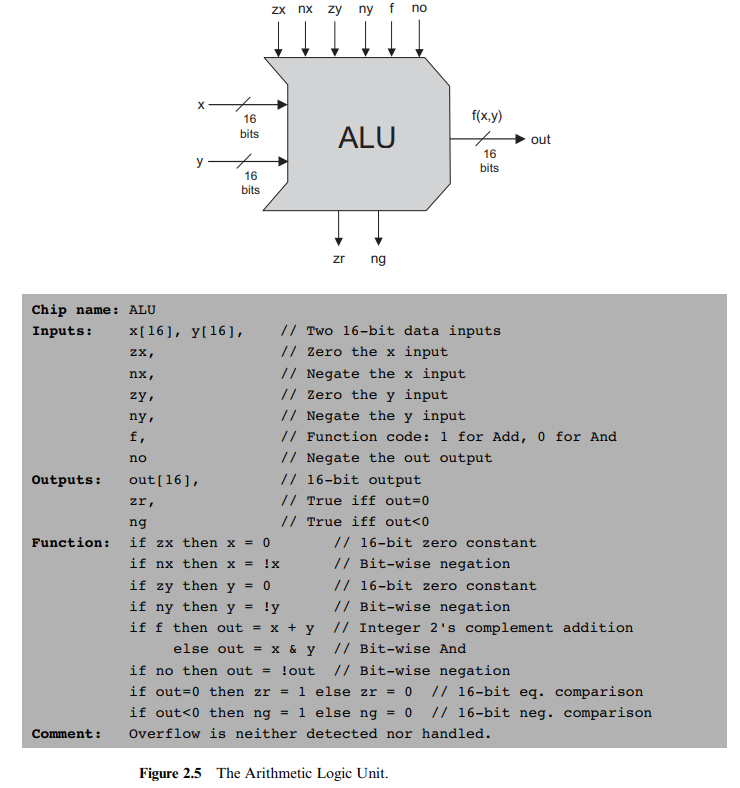

# 总结

[课程官网](https://www.nand2tetris.org/)

如名字一样，课程由非门开始，搭建出一套可以玩俄罗斯方块的电脑。

课程围绕作者自己写的教材进行设计([The Elements of Computing Systems](https://www.nand2tetris.org/book))

作者还做了一套教学视频在Coursera上。不过视频仅是讲课，信息密度低，读教材+做作业是更推荐的方式。

课程分为上下两半，每一章专注于计算机系统中的一个层次进行设计，下一层在前一层的基础上展开。

下半部分由逻辑门向上构建出数字电路模块，进而构建RAM, ROM, CPU，并组合为一台通用计算机(称为HACK)。

课程对硬件的许多电气特性做了理想化处理，但设计的核心思想仍具普遍意义。硬件设计部分采用硬件描述语言实现(HDL)。

下半部分从汇编开始，在HACK上进行软件开发，最终设计并运行俄罗斯方块这样的图形游戏。

课程内容完全自封闭，无需任何前置知识。配套内容十分完善，包括专门设计的硬件描述语言、测试脚本语言、算术逻辑单元、汇编语言、高级语言和操作系统，还有一整套仿真程序。

课程的所有作业所需工具加起来不超过1M。所有相关内容均开源。实在不能再贴心。

# 课程内容

## 一、布尔逻辑

所有组合逻辑函数均可表示为真值的与或组合式，与或非均可由与非门实现，进而可以通过与非门实现所有的组合逻辑。

逻辑式化简：配凑、裂项、反演律等。

一个逻辑函数的外部特性是唯一的，但是实现方式是多样的。需综合考虑门的数目、类型及连接数进行优化设计。

要读的材料挺多，虽然基本都学过，还是读得头大。HDL的语法与Verilog不同，有个15页的附录得读。硬件仿真器还有个长长的ppt。

### 电子电路复习

课程的最底层是与非门(Nand Gate)。课程假设已有可靠且充足的与非门，并将其作为一切的基础。

既然学过模数电，不妨再向底层探索，趁此复习一番。

#### 半导体

硅原子核最外层有4个电子。

单晶硅由整齐排列的硅原子构成，每个硅原子可以和相邻四个硅原子形成共价键，构成8电子稳定结构，称为 *本征半导体*。

本征半导体内的自由电子主要来自热量激发，导电性差。

#### PN结&二极管

在硅片内掺入硼、磷等3、5价杂质，可构成P区和N区，分别含有较多的空穴和自由电子，即载流子，导电性明显增强。

将P、N区相邻制作在一块硅片上，构成具有单向导电性PN结，即二极管。

PN结两侧载流子存在浓度差，导致扩散运动，在中间形成载流子浓度较低的耗尽层。

若加上外电场促进扩散运动，压缩耗尽层，可使扩散运动不断进行，PN结导通。

而若外电场从N区指向P区，抑制扩散运动，耗尽层增大，结的导电性变差，PN结关断。

#### 三极管

##### BJT

结型晶体管。将中间为公共区域的两个PN结制作在一起，可构成具有开关功能的三极管。

具有导通电阻小，驱动电流大的优点。

##### MOS管

金属氧化物场效应管。原理为通过电场而非电流控制电路通断。

在杂质半导体上制作制作两块高掺杂的另一极性区域，通过外加电场控制两个区域间的通断。

具有控制端无电流因此功耗低翻转快，及阻断时电阻更大等优点。

#### CMOS

根据二、三极管的控制作用，结合电源电阻，可实现多种结构的门电路。

使用最广泛的是CMOS门电路，即互补MOS管构成的与非门电路。

CMOS结构具有静态功耗小的优点。

#### 扇出

MOS门电路扇出时，次级的级间电容会由于并联线性增加，进而增大电路的翻转时间。

#### OC/OD门

OC/OD门指输出端开路的门电路，工作时需外接电源电阻。此结构可避免大电流流过三极管，实现对大电流的控制，同时还可实现线与、输出电平变换等功能。

#### 传输门

时序逻辑中常用到MOS传输门。通过互补MOS结构，确保门开启时两管不会都进入恒流区，以使导通电阻小。

#### 三态门

在数字电路输出端常用三态门，除高低电平外还可输出接近开路的高阻态，可实现总线和输入输出复用等结构。

上下管控制端加入使能管脚，使两管均阻断即可。

### HDL语言

芯片名称以大写字母开头，管脚以小写字母开头。

代码结构：注释 -> API -> 实现

管脚只可接至一个输入端，但可接多个输出端。

管脚连接中，等号左边为被调用模块内的管脚。

### 软件工具

bat为Windows端，sh为Unix端启动器。

设计完hdl文件后load对应的tst脚本进行测试即可。

可使用内置的模块提高仿真效果，只要目录下无对应模块文件即会调用内置模块。

注意使设计顺序与书中一致，可实现仅用与非门搭建所有模块的效果。

### 代码

数电内容的子集，没啥好说。写起来还是有不少繁琐的地方。

这种轻量化的HDL工具上手比Vivado容易许多，同时该有的功能都有。对初学者很友好。

## 二、布尔计算

### 进制转换

2 -> 10: 依权重相加。

10 -> 2: 以2除十进制数，余数即为最低位的值。以商作为新的十进制数，递归，可得结果。

### 负数表示

对N位二进制有符号数，通常采用方式补码实现，即原码取反再加一。利用二进制计算舍去溢出位的特点实现负数计算。

可理解为作映射 $(-2^{N-1}, -1) -> (2^{N-1}, 2^N-1)$。此时有 $x + (-x) = 2^N = 0$。

输入输出位数相同，结果的值应当处于可表示的范围内，否则需增加系统位数。

### 加法器

组合逻辑的多位加法器时序上存在竞争冒险问题，低位的进位信号需要更长的时间到达。

串行进位加法器设计简单，但速度慢。超前进位加法器通过增加电路的复杂度，更快得到高位的进位信号。

### ALU

算术逻辑单元。通过控制端实现对操作数的多种计算。

HACK的ALU有六个控制端，可实现最多64种不同的计算。

注意取反和负数的区别。对N位系统， $x∈(0,2^{N-1}-1), !x = 2^N-1-x, -x=2^N-x, !(-x)=x-1$。

HACK设计十分简单，但功能足够。作者说是通过列出想实现的功能再逆推化简的方式设计而来。

此ALU没有乘除及浮点等功能，后续将通过操作系统等软件方式实现。但实际的ALU往往会通过硬件实现这类基本算术功能，以成本换取软件运行速度。

### 代码

比第一章还简单，照提示来即可。注意第零位为LSB，只允许在输出端切片，zr在out全零时置高。

## 三、时序逻辑

时序的概念使电路可以存储过去的状态，让电路中的反馈变得更加可控，门的翻转时间和传输时延导致的竞争冒险问题在边沿触发的时序电路中得到改善。

### 电子电路复习

#### 锁存器

将信号通过两个非门接回输入，就得到了一个可以保持自身状态的电路，称为锁存器。

将非门换成有两个输入端的或非或与非门，就得到了一个可以设置状态的锁存器，称为SR锁存器。两个外部输入端分别称为复位、置位端。

#### 触发器

将SR锁存器的输入端与时钟信号相与，使其可受时钟控制，称为触发器，触发方式为电平触发。

将置位复位端通过非门合在一起，称为D触发器。

CMOS电路中，也可在非门环路的输入和反馈电路中放置两个互补控制的传输门，利用门的延时构成D触发器。

将两个电平触发的D触发器连在一起，输入相反的时钟信号，利用门电路的少量延时，可实现边沿触发的触发器。

将边沿触发器中的D触发器换成SR触发器，此时输入端可能在触发后回到保持态，构成脉冲触发的触发器。

可在脉冲触发器输入端加上输出端的反馈控制，使其在一个时钟周期内只可响应一次触发信号，构成JK触发器。

#### 寄存器

多个D触发器并列，构成寄存器。实际往往还会加入保持、异步清零、三态输出等功能。保持功能可通过禁用时钟信号实现。

#### RAM(Random Access Memory)

##### Static RAM/SRAM

原理与触发器相同，故速度最快，成本最高。常用作缓存(Cache)。

##### Dynamic RAM/DRAM

利用MOS电容存储，结构简单，集成度高。速度慢于SRAM，需要定期刷新。常用作内存(Memory)。

#### ROM(Read-Only Memory)

经过发展，现有的ROM主要为采用闪存(Flash Memory)技术，可写，但写入速度远低于读取。常用于存放固件。

Flash的快速发展正使其在移动设备领域替代硬盘，SSD硬盘的原理与Flash有相似之处。